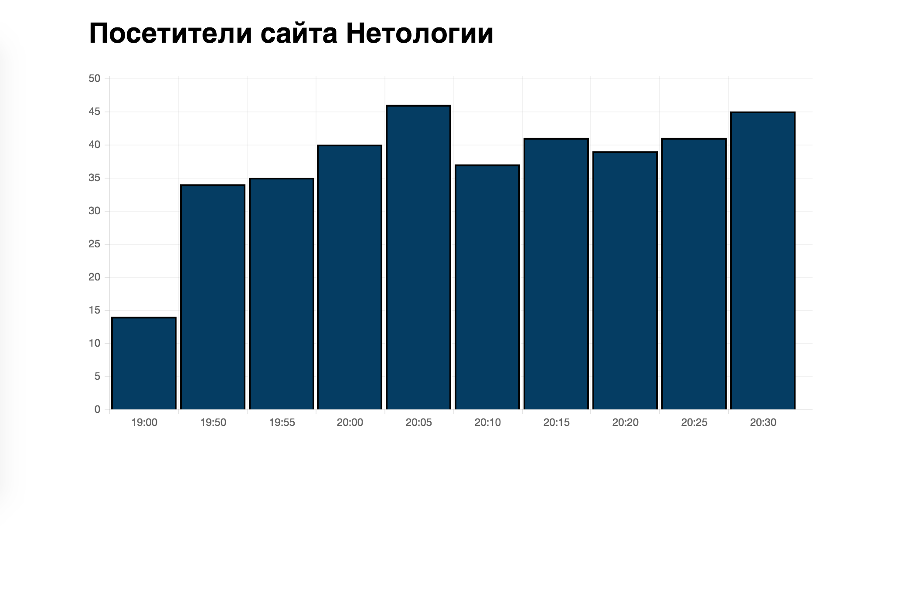

Посетители сайта в реальном времени
===

Вам необходимо восстановить работу диаграммы, отображающей количество посетителей на сайте в реальном времени:

## Данные

Для получения данных устанавливается веб-сокет соединение с `wss://neto-api.herokuapp.com/realtime`. В первом сообщении сервер передаёт список измерений за прошлый период. А в последующих — одно текущее измерение.

В изначальной версии веб-сокет сервер передавал данные в виде строки с разделителями: `\n` для измерений, и `|` для того, чтобы отделить метку от данных. Наш backend-разработчик обновил сервер и поменял формат кодирования данных. К сожалению, он серьезно заболел и не оставил никаких описаний нового формата.

Поэтому вам предстоит самостоятельно выяснить в каком формате передаются данные, и исправить работу приложения.

## Интерфейс

Для отображения гистограммы используется библиотека `Chart.js`. Нет необходимости её подробно изучать, так как вся логика работы с ней уже реализована в программе. И вам лишь нужно передать туда правильные данные. Но, чтобы вам было проще понять что к чему, поясним некоторые моменты.

В переменной `realtime` доступен объект гистограммы, через который можно взаимодействовать с ней. Так как она уже создана и настроена, то нам остаётся только добавлять в неё новые данные.

В переменной `ws` доступен объект веб-сокет соединения. Данные гистограммы обновляются в событии `message` этого соединения.

Переменная `isFirst` позволяет нам отличить первое сообщение от последующих. Далее мы получаем строку через сокет-соединение и разбиваем её на фрагменты, соответствующие измерениям, по символу `\n`. После чего каждый фрагмент разбиваем на метку и значение по символу `|`. И добавляем каждое измерение на гистограмму с помощью метода `addData`. Первым аргументом передаем массив наборов данных (_dataset_), в котором только одно наше значение. Приводим его к числу. Вторым аргументом передаём метку.

При обработке последующих сообщений логика та же, только передаётся всего одно измерение, и поэтому мы пропускаем один этап. Также, чтобы на гистограмме были только последние 10 измерений, мы удаляем то, которое была добавлено первым, с помощью метода `removeData`.

## Реализация

Попробуйте выяснить формат передаваемых данных, не внося изменения в текущий код. И только потом приступайте к переработке скрипта.

### Локально с использованием git

Внесите изменения в файл `./js/realtime.js`. Файл уже подключен к документу, поэтому другие файлы изменять не требуется.

### В песочнице CodePen

Внесите изменения во вкладке JS. Перед началом работы сделайте форк этого пена:

https://codepen.io/dfitiskin/pen/oGxyMw
